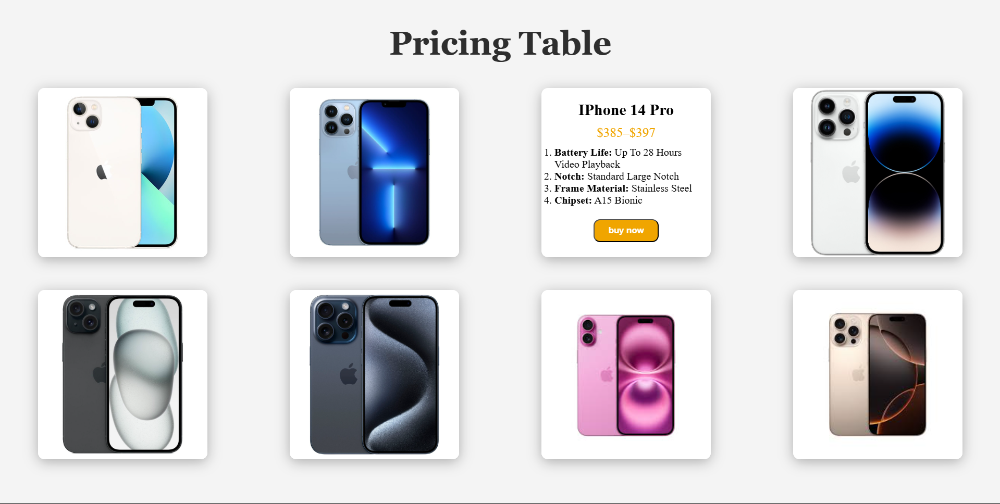

# 📱 Simple Pricing Table

A visually appealing and responsive pricing display for various iPhone models using **HTML** and **CSS**. This project replicates a modern Apple-style product showcase.

---

## 🖼️ Preview



---

## 📦 iPhone Models Included

- iPhone 13
- iPhone 13 Pro
- iPhone 14
- iPhone 14 Pro
- iPhone 15
- iPhone 15 Pro Max
- iPhone 16
- iPhone 16 Pro Max (concept)

---

## 🎨 Design Features

- Soft gray background (`#f4f4f4`) for a clean look
- White cards with subtle shadows for modern UI feel
- Responsive grid layout (auto-fit)
- Image-first presentation with hover highlights
- Optional detailed box with pricing and specs

---

## 🛠️ Technologies Used

- HTML5 for structure
- CSS3 for styling (grid, box-shadow, typography)

---

## 🚀 How to Use

1. Clone the repo:
   ```bash
url--(https://yaminqabaha7.github.io/Simple-Pricing-Table/)
   ```

2. Open the main file:
   ```bash
   open index.html
   ```

3. Replace images in `/img/` folder to match your needs

4. Customize specs and pricing in HTML markup as needed

---

## 📌 Styling Suggestions

- Font: 'Segoe UI' or 'SF Pro Text'
- Title Color: `#2E2E2E`
- Price Color: `#F0A500` (gold highlight)
- Box Shadow: `rgba(0,0,0,0.08)`

---

> Made with 💻 and 🎨 to simulate Apple-style product cards.
